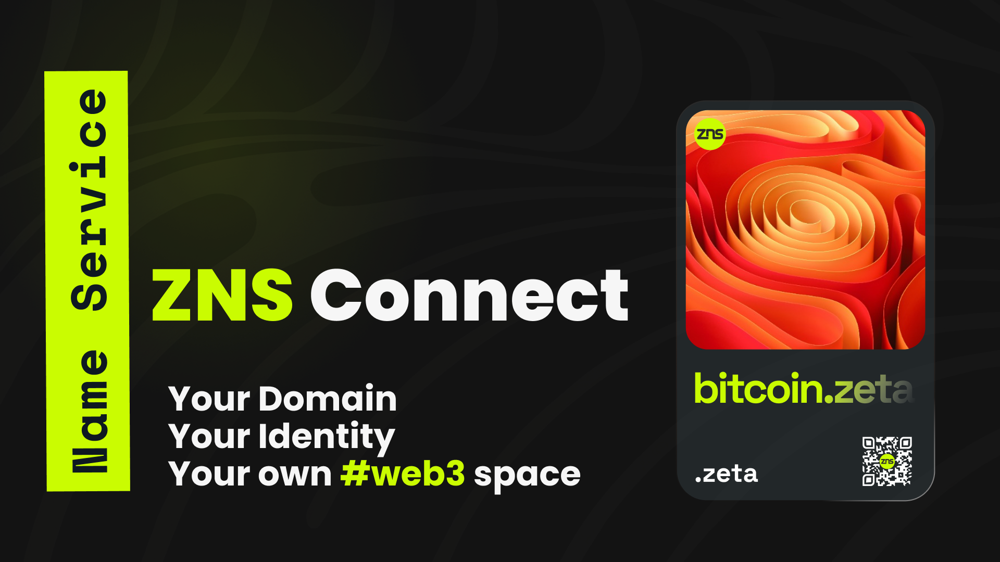

# ℹ️ Introduction

<figure><figcaption></figcaption></figure>

## About ZNS Connect

**ZNS Connect is a decentralized naming system** built on the Polygon and Zetachain blockchain. Our mission is to simplify the Web3 experience by offering user-friendly and memorable domain names.

**ZNS Connect APP simplifies Web3** interactions by replacing complex addresses with user-friendly names, providing a seamless experience for users. Built on Zetachain, Polygon, and other EVM-compatible chains, ZNS Connect empowers users with enhanced digital identities and enables smooth transactions across various blockchains.

**What We're Building:**\
We're on a mission to redefine how you experience the Web3 world. We're creating a decentralized naming service that spans Omnichain, designed for Web3, Identifiers, and DAOs. Our goal is to empower users with enhanced digital identities and facilitate smooth transactions across various blockchains

**Key Highlights:**

\- Launched on the Polygon Mainnet and Zetachain testnet

\- 45,000+ Domain Minting

\- 3th place out of 5,300 projects at the DoraHacks hackathon

\- 8th place in the NFT category on Magic Store

\- Officially verified on NFTScan Explorer

\- ZNS Connect integrate OKX Web3 wallet

\- 40K Followers Milestone Reached

\- We are an integral part of the Zetachain Ecosystem

As part of the Zetachain Ecosystem, ZNS Connect is proud to be a key player in the blockchain revolution, contributing to the mass adoption of Web3 technologies.

* **1.1 Overview:** The overview section provides a high-level understanding of the ZNS Connect Name Service (ZNS). It describes ZNS as a decentralized naming system built on the Zetachain blockchain that aims to simplify the identification and interaction of participants within the web3 ecosystem. It emphasizes the importance of user-friendly and memorable names in place of complex addresses for improved user experience and widespread adoption.
* **1.2 Objectives:** The objectives section outlines the specific goals and objectives of the ZNS Connect Name Service. It highlights the primary intentions of ZNS, which may include enhancing user accessibility and convenience, enabling seamless cross-chain interactions, establishing decentralized web identities, improving branding and reputation management, and facilitating the verification of NFTs and artistic works. These objectives serve as the guiding principles behind the development and implementation of ZNS.
* **1.3 Benefits:** The benefits section focuses on the advantages and positive outcomes that ZNS brings to the blockchain ecosystem. It elaborates on the potential benefits for users, developers, and the wider community. These benefits may include simplified addressing and user experience, increased trust and authenticity, improved discoverability and interactions, enhanced security and privacy, efficient management of digital assets, and seamless integration with social platforms. By highlighting these benefits, the section showcases the value proposition of ZNS.
