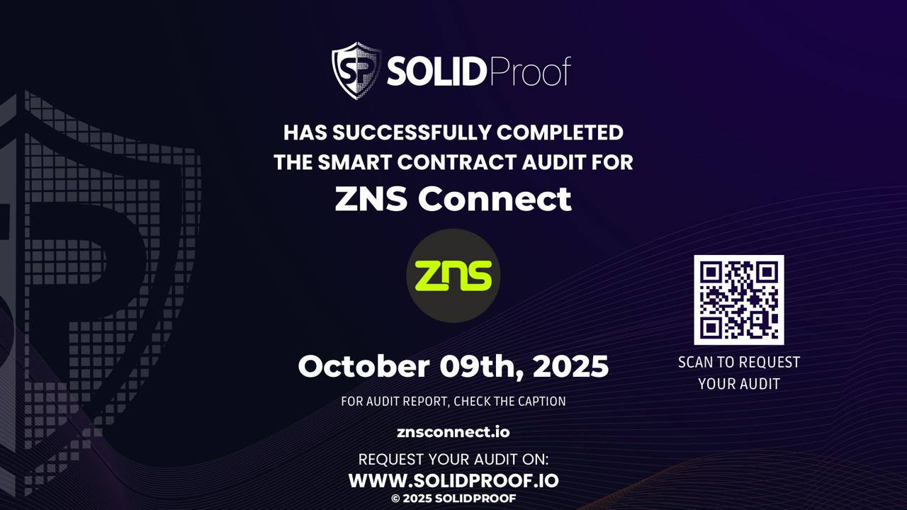

# Audit by Solidproof

The Team provided us with the files that should be tested in the security assessment. This audit covered the following files listed below with a **TrustNet Score 80.00**.

**Please note:** Files with a different hash value than in this table have been modified after the security check, either intentionally or unintentionally. A different hash value may (but need not) be an indication of a changed state or potential vulnerability that was not the subject of this scan.[\
](https://www.oklink.com/xlayer/address/0x5F2760817940bC0A3e3974e117506d1Dd7855C4e/contracthttps://www.oklink.com/xlayer/address/0x7846766Fe7a1031E7E9211C9276445155ff9cD92/contracthttps://www.oklink.com/xlayer/address/0x71709A5f1831bA48C414375Fb6a58662A40C01b5/contract)\
[https://app.solidproof.io/projects/zns-connect](https://app.solidproof.io/projects/zns-connect)&#x20;

<figure><figcaption></figcaption></figure>

Used code from other Frameworks/Smart Contracts.

And more old Audit - made in 2024&#x20;

{% embed url="https://github.com/solidproof/projects/tree/main/2024/ZNS%20Connect" %}
ZNS Connect audit on Github



ZNS Connect PDF Audit


