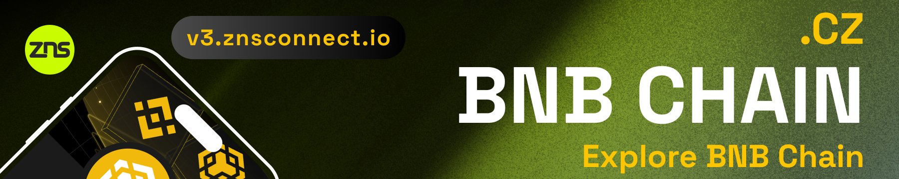

# ✖️ Contract Address of ZNS


All contracts are verified on their respective networks.


<figure><figcaption></figcaption></figure>

### .xlayer on Xlayer chain

<table><thead><tr><th width="286.57894736842104">Chain</th><th>Contract Address</th></tr></thead><tbody><tr><td>Xlayer Registry</td><td><a href="https://www.oklink.com/xlayer/address/0x71709a5f1831ba48c414375fb6a58662a40c01b5">0x71709a5f1831ba48c414375fb6a58662a40c01b5</a></td></tr><tr><td>Xlayer Gift Cards</td><td><a href="https://www.oklink.com/xlayer/address/0x7846766fe7a1031e7e9211c9276445155ff9cd92">0x7846766Fe7a1031E7E9211C9276445155ff9cD92</a></td></tr></tbody></table>

<figure><figcaption></figcaption></figure>

### .cz on BNB chain

<table><thead><tr><th width="290.57894736842104">Chain</th><th>Contract Address</th></tr></thead><tbody><tr><td>BNB Chain Registry</td><td><a href="https://bscscan.com/address/0x7e2cf06f092c9f5cf5972ef021635b6c8e1c5bb2">0x7e2CF06F092c9F5cF5972eF021635b6c8E1C5bb2</a></td></tr><tr><td>BNB Chain Gift Cards</td><td><a href="https://bscscan.com/address/0x3f2cab35169106f581e462591117225b2d583061">0x3f2caB35169106f581E462591117225B2D583061</a></td></tr></tbody></table>

###

<figure><figcaption></figcaption></figure>

### .scroll on Scroll chain

<table><thead><tr><th width="290.57894736842104">Chain</th><th>Contract Address</th></tr></thead><tbody><tr><td>Scroll Chain Registry</td><td><a href="https://scrollscan.com/address/0xb00910bac7da44c0d440798809dbf8d51fdbb635">0xB00910Bac7DA44c0D440798809dbF8d51FDBb635</a></td></tr><tr><td>Scroll Chain Gift Cards</td><td><a href="https://scrollscan.com/address/0xe6f54791f1d6bdc158b12a9ee9a08cfa550dc819">0xE6F54791f1d6bDc158b12A9eE9A08cFa550DC819</a></td></tr></tbody></table>

<figure><figcaption></figcaption></figure>

<figure><figcaption></figcaption></figure>

### .honey on Berachain testnet

<table><thead><tr><th width="290.57894736842104">Chain</th><th>Contract Address</th></tr></thead><tbody><tr><td>Berachain Chain Registry</td><td><a href="https://artio.beratrail.io/address/0xA4d4d21E6C52F9490D1902CB84DB43eAD89a072D">0xA4d4d21E6C52F9490D1902CB84DB43eAD89a072D</a></td></tr><tr><td>Berachain Gift Cards</td><td><a href="https://artio.beratrail.io/token/0x72Df14dDF6e9E5F12A5FE661623F257B4258aB4C">0x72Df14dDF6e9E5F12A5FE661623F257B4258aB4C</a></td></tr></tbody></table>

<figure><figcaption></figcaption></figure>
