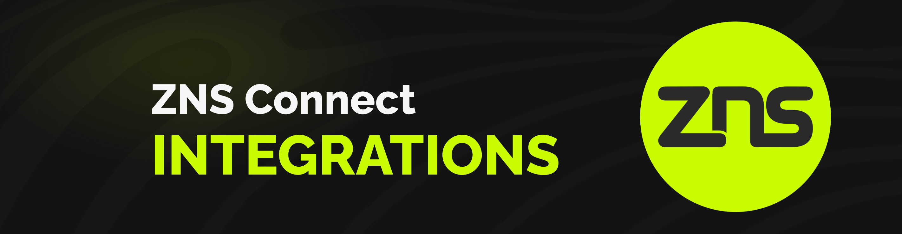

# Integrations

<figure><figcaption></figcaption></figure>

#### Script to lookup wallet address behind a domain name


```javascript
const { Web3 } = require('web3');
const RPC_URL_POLYGON_MUMBAI = "https://rpc.ankr.com/polygon_mumbai";
const RPC_URL_ZETACHAIN_ATHENS2 = "https://rpc.ankr.com/zetachain_evm_testnet";

const contractABI = require('./abi.json');
const domainName = "nerosensei.zero";
const chainID = 80001;

async function getWalletAddress(domainName, chainID) {

    if (chainID == 80001) {
        if (domainName.includes('.zeta')) {
            const web3 = new Web3(RPC_URL_POLYGON_MUMBAI);
            const contractAddress = '0x956A8c9849696eB181dbC4C02C89747683209a7F';
            const cleanedDomainName = domainName.replace('.zeta', '');
            const contract = new web3.eth.Contract(contractABI, contractAddress);
            const tokenID = await contract.methods.domainNameToTokenID(cleanedDomainName).call();
            const message = await contract.methods.registryLookup(tokenID).call();
            const result = {
                owner: message[0],
                domainName: message[1],
                length: parseInt(message[2]),
                expirationDate: parseInt(message[3]),
            };
            console.log(result);
        }
        else if (domainName.includes('.zero')) {
            const web3 = new Web3(RPC_URL_POLYGON_MUMBAI);
            const contractAddress = '0x2B659922eD073050bC7E2aa59143a758EE9b230c';
            const cleanedDomainName = domainName.replace('.zero', '');
            const contract = new web3.eth.Contract(contractABI, contractAddress);
            const tokenID = await contract.methods.domainNameToTokenID(cleanedDomainName).call();
            const message = await contract.methods.registryLookup(tokenID).call();
            const result = {
                owner: message[0],
                domainName: message[1],
                length: parseInt(message[2]),
                expirationDate: parseInt(message[3]),
            };
            console.log(result);
        }
    }

    else if (chainID == 7001) {

        if (domainName.includes('.zeta')) {
            const web3 = new Web3(RPC_URL_ZETACHAIN_ATHENS2);
            const contractAddress = '0x5253200B40147acC025A56A36DFc233a56F78E74';
            const cleanedDomainName = domainName.replace('.zeta', '');
            const contract = new web3.eth.Contract(contractABI, contractAddress);
            const tokenID = await contract.methods.domainNameToTokenID(cleanedDomainName).call();
            const message = await contract.methods.registryLookup(tokenID).call();
            const result = {
                owner: message[0],
                domainName: message[1],
                length: parseInt(message[2]),
                expirationDate: parseInt(message[3]),
            };
            console.log(result);
        }
        else if (domainName.includes('.zero')) {
            const web3 = new Web3(RPC_URL_ZETACHAIN_ATHENS2);
            const contractAddress = '0x5457c87729ECa1f4E641Af87f9835bC558c18bFA';
            const cleanedDomainName = domainName.replace('.zero', '');
            const contract = new web3.eth.Contract(contractABI, contractAddress);
            const tokenID = await contract.methods.domainNameToTokenID(cleanedDomainName).call();
            const message = await contract.methods.registryLookup(tokenID).call();
            const result = {
                owner: message[0],
                domainName: message[1],
                length: parseInt(message[2]),
                expirationDate: parseInt(message[3]),
            };
            console.log(result);
        }
    }
}

getWalletAddress(domainName, chainID);
```


**The ABI can be found here :** [**abi.json**](https://github.com/ZNS-Connect/zns-contracts/blob/main/scripts/abi.json)

Web3.js has been used here to call the view function called `registryLookup` of the contracts. You can use any web3 library. The `registryLookup` function returns a struct :

```solidity
struct RegistryData {
    address owner;
    string domainName;
    uint256 length;
    uint256 expirationDate;
}
```

If the return values are empty that would suggest that the domain is not owned by anyone and has not been minted yet.


To find what domains are owned by a specific wallet address one can query the `ownedDomains`function, this takes in 2 params. First is the wallet address and the second in the index (pass 0 here). The output will be a tokenID which corresponds to a domain name. We can find out what the domain name behind this TokenID by calling the `tokenIDToDomainName` function which takes the tokenID as a parameter.

